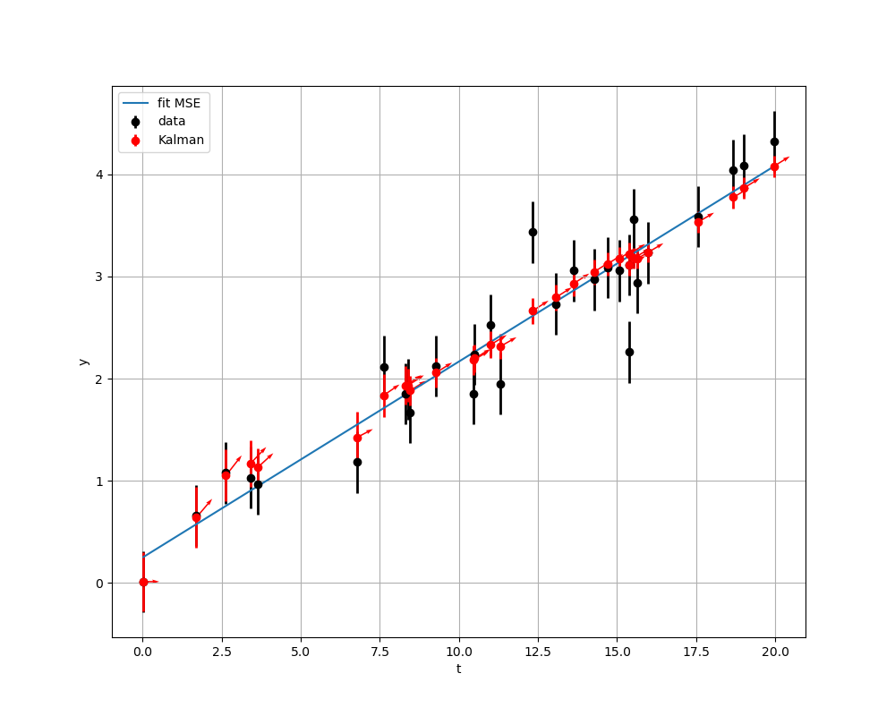

# About the project
This is a fork from [jaxman](https://github.com/tingiskhan/jax-kalman) with extensions.  

# Getting started
Follow the below instructions in order to get started.

## Prerequisites
Start by [installing JAX](https://jax.readthedocs.io/en/latest/installation.html).

## Installation
The library is currently not available on pypi, and there are currently no plans on releasing it there.

# Usage
Beyond the original `KalmanFilter` (alias to `KalmanFilterStd`)  class that deals with equaly spaced observations, the extension provides `KalmanFilterNonEquid` class
`
```python
from jaxkalm import KalmanFilterNonEquid
import jax.random as jaxrnd
import matplotlib.pyplot as plt
import jax.numpy as jnp
import jax.scipy as jsc
from jax.scipy import optimize

#simple linear modeling to generate a dataset
def mean_fn(t,p):
    return p[0] + p[1]*t

#this loss function is used by BFGS-optimize to compare with Kalman filetring
def lik(p,xi,yi, sigma_obs):
    resid = mean_fn(xi, p)-yi
    return 0.5*jnp.sum((resid/sigma_obs) ** 2) 

#Random gene
rng_key = jaxrnd.PRNGKey(10)
rng_key, rng_key0 = jaxrnd.split(rng_key)

#dataset (t,y)_i
tMes = jax.random.uniform(rng_key0,minval=0.,maxval=20.0,shape=(30,))
tMes=jnp.sort(tMes)
par_true = jnp.array([0.1,0.2])
sigma_obs = 0.3
yMes = mean_fn(tMes,par_true) + sigma_obs * jaxrnd.normal(rng_key0,shape=tMes.shape)

#BFGS minisation
bfgs_fit= optimize.minimize(lik, jnp.array([0.,0.]),
                               args=(tMes,yMes,sigma_obs), method='BFGS', tol=1e-6, options=None)
p_fit = bfgs_fit.x # parameter fitted
y_fit = mean_fn(tMes, p_fit) # (t,y(t)) from fitted model

#Kalman
# The vector state is  X=(y,dy/dx)^T
#

# prediction: transport matrix k-1 -> k of state vector
def trans_mat_func(dt: float) -> jnp.array:
   return  jnp.array([[1., dt],[0.,1.]]) 
def trans_cov_func(dt: float) -> jnp.array:
    return jnp.zeros(shape=(2,2))   #no perturbation during prediction


# observation aka measurements
obs_mat = jnp.array([1.0,0.])              # projection matrix from mesurement to vector state (the measure is y_mes only)
obs_cov = sigma_obs**2                     # error (here 1D) on mesurement

# prepare Kalman filter
kf = KalmanFilterNonEquid(trans_mat_func, trans_cov_func,
                              obs_mat, obs_cov) 


result = kf.filter(yMes,tMes)             # iterate the kalman filtering automatic init.

#for the plot see the file ./tests/test_predict_function.py
```
Resulting in the following pretty picture

<div align="center"> 
    
</div>

# Disclaimers
Note that this project is not endorsed, affiliated or supported by Google/JAX, the name is just a mash-up of Kalman and JAX.
