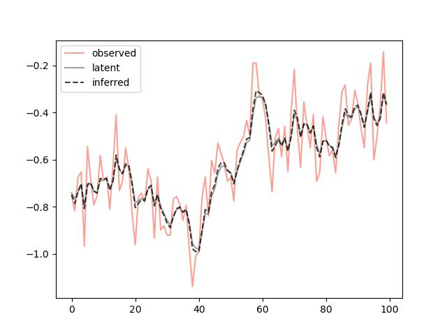

# About the project
This is a fork from [jaxman](https://github.com/tingiskhan/jax-kalman) with extensions.  

# Getting started
Follow the below instructions in order to get started.

## Prerequisites
Start by [installing JAX](https://jax.readthedocs.io/en/latest/installation.html).

## Installation
The library is currently not available on pypi, and there are currently no plans on releasing it there.

# Usage
A trivial random walk example follows below, in which we simulate 100,000 independent series of length 100, and then filter the observations
```python
from jaxkalm import KalmanFilter
import jax.random as jaxrnd
from timeit import timeit
import matplotlib.pyplot as plt

trans_mat = 1.0
trans_cov = 0.05 ** 2

obs_mat = 1.0
obs_cov = 0.1 ** 2

kf = KalmanFilter(trans_mat, trans_cov, obs_mat, obs_cov)

x, y = kf.sample(100, jaxrnd.PRNGKey(123), (100_000,))
result = kf.filter(y)

# And do a quick timing
print(timeit(lambda: kf.filter(y), number=1))
>>> 3.6531236000000717

fig, ax = plt.subplots()

ax.plot(y[:, 0], color="salmon", label="observed", alpha=0.75)
ax.plot(x[:, 0], color="gray", label="latent", alpha=0.75)

ax.plot(result.filtered_means()[:, 0], color="black", linestyle="--", label="inferred", alpha=0.75)
ax.legend()

plt.show()
```
Resulting in the following pretty picture

<div align="center"> 
    
</div>

# Disclaimers
Note that this project is not endorsed, affiliated or supported by Google/JAX, the name is just a mash-up of Kalman and JAX.
